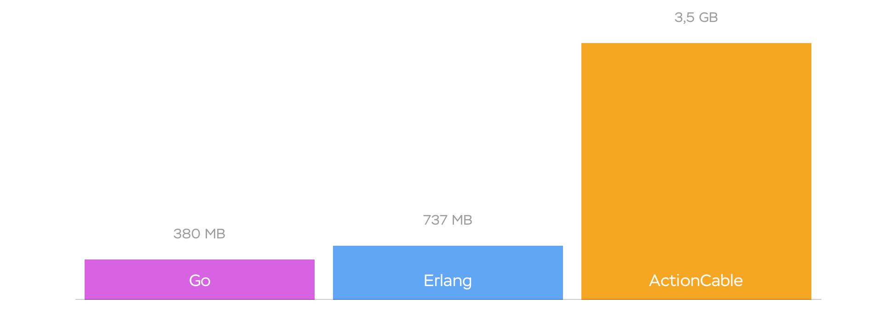
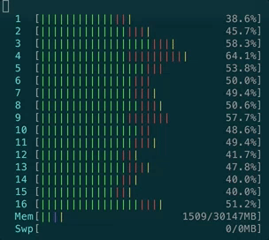
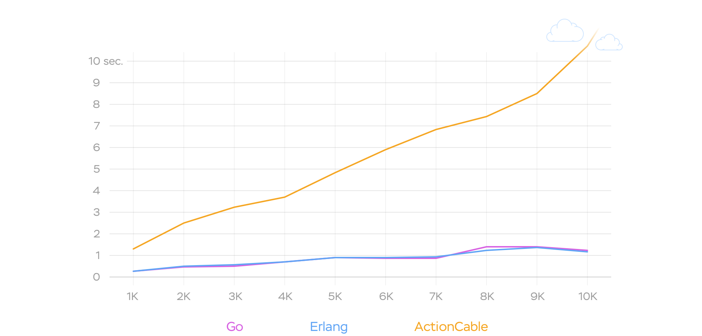
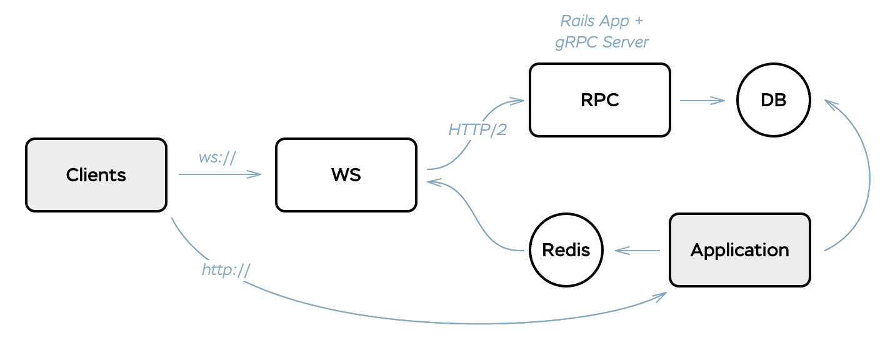
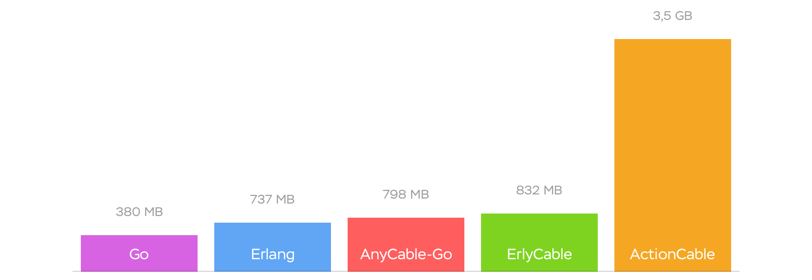
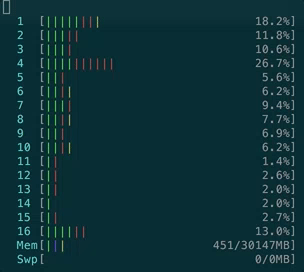
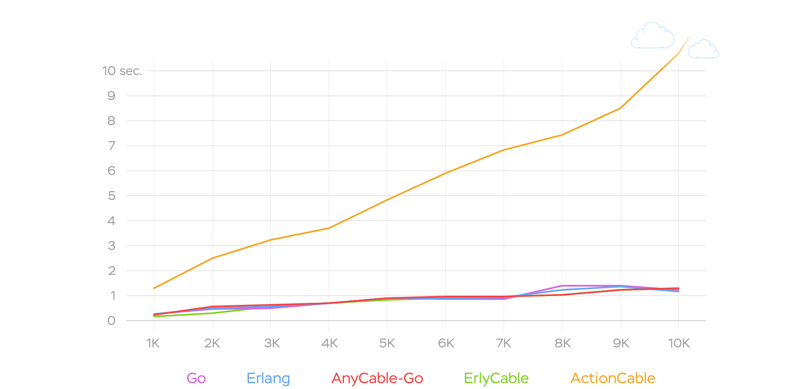

#HSLIDE

## AnyCable
### A polyglot replacement for ActionCable server

#HSLIDE

## ActionCable

#### Easy to use <!-- .element: class="fragment" -->

#### Allows you to access business logic  <!-- .element: class="fragment" -->

#### Has JS client that just works <!-- .element: class="fragment" -->

#HSLIDE

## ActionCable

### is good for [designing live features](http://weblog.rubyonrails.org/2016/6/30/Rails-5-0-final/)

#HSLIDE

## But...
### is it ready for production?

#HSLIDE

## Benchmarks

#### Unfortunately, ActionCable leaves much to be desired

Press Down key to see charts and gifs

#VSLIDE

## Memory

#VSLIDE

## CPU

#VSLIDE

## Broadcast Round Trip Time

#HSLIDE

### Let's extract WebSockets somewhere else!

#HSLIDE

## AnyCable

#### Combines the good parts from ActionCable with the power of your favorite language for concurrent applications

How it works? See below

#VSLIDE

## How AnyCable Works

#VSLIDE

## [gRPC](http://grpc.io)

### Makes AnyCable to be a polyglot

#VSLIDE

## AnyCable

#### [Compatible](https://github.com/anycable/anycable#actioncable-compatibility) with ActionCable (channels, javascript, broadcasting)

#### You can still use ActionCable for development and testing

#VSLIDE

## AnyCable Servers

- [anycable-go](https://github.com/anycable/anycable-go)

- [erlycable](https://github.com/anycable/erlycable)

#VSLIDE

## AnyCable

### [Demo Application](https://github.com/anycable/anycable_demo)

#HSLIDE

## Benchmarks Again

#### AnyCable shows much more better performance.

Press Down key to see charts and gifs

#VSLIDE

## Memory

#VSLIDE

## CPU

#VSLIDE

## Broadcast Round Trip Time

#HSLIDE

## Let's Make ActionCable Not Suck!

[anycable.evilmartians.io](http://anycable.io/)

Vladimir Dementyev [@palkan_tula](http://twitter.com/palkan_tula)

[Evil Martians](http://evilmartians.com)

Twitter [@any_cable](http://twitter.com/any_cable)

GitHub [@anycable](http://github.com/anycable)
