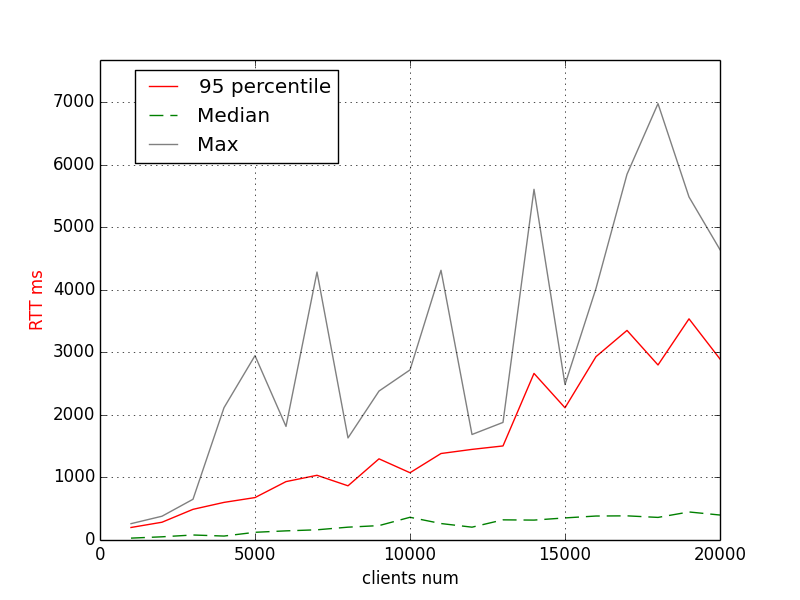
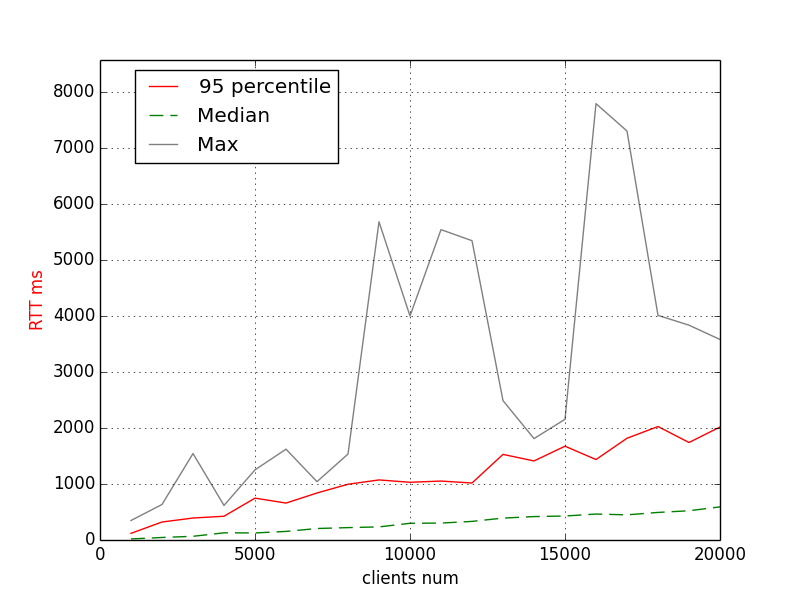
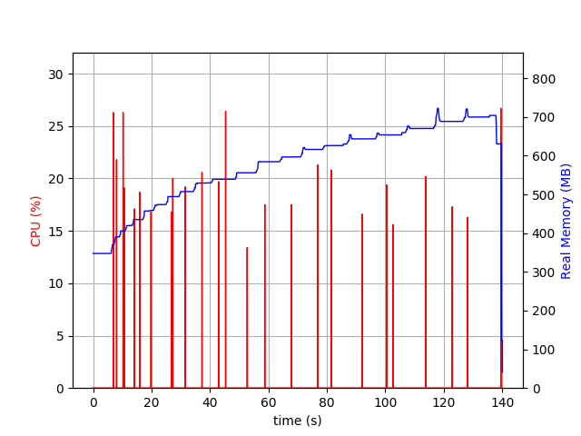

# WebSocket Shootout Benchmark (2018-10-27)

Code: https://github.com/palkan/websocket-shootout

Client/Server instances: c3.2xlarge (8 vCPU, 15 GiB RAM).

Ruby: 2.5.1p57 (2018-03-29 revision 63029) [x86_64-darwin16]
Rails: 5.2.0 / 6.0.0.aplha (this [PR](https://github.com/rails/rails/pull/33295))

The benchmark measures broadcasting RTT for 10k clients and the memory usage.

Memory usage charts were captured with [psrecord](https://github.com/astrofrog/psrecord):

```sh
psrecord <pid> --include-children --plot plot.png
```

## Action Cable + Puma (8 workers)

Server: `WEB_CONCURRENCY=8 bundle exec rails s -p 3334 -e production`

```
$ bin/websocket-bench broadcast  --concurrent 8 --sample-size 100 --step-size 1000 --payload-padding 200 --total-steps 10 --origin http://0.0.0.0 ws://172.31.21.207:3334/cable --server-type=actioncable

clients:  1000    95per-rtt: 2470ms     min-rtt:   1ms    median-rtt: 518ms     max-rtt: 2893ms
clients:  2000    95per-rtt: 3066ms     min-rtt:   1ms    median-rtt: 1045ms    max-rtt: 3878ms
clients:  3000    95per-rtt: 3785ms     min-rtt:   1ms    median-rtt: 2071ms    max-rtt: 4211ms
clients:  4000    95per-rtt: 5141ms     min-rtt:   1ms    median-rtt: 2363ms    max-rtt: 6042ms
clients:  5000    95per-rtt: 9477ms     min-rtt:   1ms    median-rtt: 3283ms    max-rtt: 10000ms
clients:  6000    95per-rtt: 7038ms     min-rtt:   1ms    median-rtt: 3898ms    max-rtt: 8684ms
clients:  7000    95per-rtt: 8517ms     min-rtt:   2ms    median-rtt: 4108ms    max-rtt: 8436ms
clients:  8000    95per-rtt: 9105ms     min-rtt:   2ms    median-rtt: 5387ms    max-rtt: 9166ms
clients:  9000    95per-rtt: 10064ms    min-rtt:   1ms    median-rtt: 5335ms    max-rtt: 10108ms
clients: 10000    95per-rtt: 15766ms    min-rtt:   2ms    median-rtt: 5921ms    max-rtt: 17907ms
```


## Action Cable + Iodine (8 workers & 16 threads)

Server: `bundle exec iodine -p 3334 -w 8 -t 16`

```
$ bin/websocket-bench broadcast  --concurrent 8 --sample-size 100 --step-size 1000 --payload-padding 200 --total-steps 10 --origin http://0.0.0.0 ws://172.31.21.207:3334/cable --server-type=actioncable

clients:  1000    95per-rtt: 2354ms     min-rtt:   1ms    median-rtt: 798ms      max-rtt: 2944ms
clients:  2000    95per-rtt: 3199ms     min-rtt:   2ms    median-rtt: 2068ms     max-rtt: 3603ms
clients:  3000    95per-rtt: 4808ms     min-rtt:   2ms    median-rtt: 3226ms     max-rtt: 6016ms
clients:  4000    95per-rtt: 6628ms     min-rtt:   1ms    median-rtt: 4511ms     max-rtt: 7520ms
clients:  5000    95per-rtt: 7761ms     min-rtt:   1ms    median-rtt: 5592ms     max-rtt: 8828ms
clients:  6000    95per-rtt: 17042ms    min-rtt:   1ms    median-rtt: 4557ms     max-rtt: 18245ms
clients:  7000    95per-rtt: 12331ms    min-rtt:   1ms    median-rtt: 8355ms     max-rtt: 13525ms
clients:  8000    95per-rtt: 16785ms    min-rtt:   2ms    median-rtt: 6217ms     max-rtt: 17609ms
clients:  9000    95per-rtt: 18438ms    min-rtt:   1ms    median-rtt: 1111ms     max-rtt: 18848ms
clients: 10000    95per-rtt: 19034ms    min-rtt:   1ms    median-rtt: 11235ms    max-rtt: 24343ms
```


## Action Cable + Falcon (8 workers)

Server: `RAILS_ENV=production bundle exec falcon serve -b http://0.0.0.0:3334`

```
$ bin/websocket-bench broadcast  --concurrent 8 --sample-size 100 --step-size 1000 --payload-padding 200 --total-steps 10 --origin http://0.0.0.0 ws://172.31.21.207:3334/cable --server-type=actioncable


clients:  1000    95per-rtt: 1957ms     min-rtt:   1ms    median-rtt: 766ms     max-rtt: 2077ms
clients:  2000    95per-rtt: 5225ms     min-rtt:   1ms    median-rtt: 624ms     max-rtt: 5969ms
clients:  3000    95per-rtt: 6358ms     min-rtt:   2ms    median-rtt: 1205ms    max-rtt: 7116ms
clients:  4000    95per-rtt: 8878ms     min-rtt:   1ms    median-rtt: 1152ms    max-rtt: 10167ms
clients:  5000    95per-rtt: 8829ms     min-rtt:   1ms    median-rtt: 2368ms    max-rtt: 9792ms
clients:  6000    95per-rtt: 10831ms    min-rtt:   1ms    median-rtt: 2892ms    max-rtt: 12766ms
clients:  7000    95per-rtt: 12760ms    min-rtt:   1ms    median-rtt: 5229ms    max-rtt: 14713ms
clients:  8000    95per-rtt: 15512ms    min-rtt:   1ms    median-rtt: 4843ms    max-rtt: 16353ms
clients:  9000    95per-rtt: 20176ms    min-rtt:   1ms    median-rtt: 4919ms    max-rtt: 22529ms
clients: 10000    95per-rtt: 19865ms    min-rtt:   1ms    median-rtt: 4733ms    max-rtt: 20686ms
```


**NOTE**: for some reason `psrecord` reports negative RSS usage when Falcon starts (almost every run).

## Action Cable + AnyCable-Go 0.6.0.alpha

**NOTE**: this benchmark has twice more steps (i.e. 20k instead of 10k).

Server: `ANYCABLE_GO_BIN="anycable-go-0.6.0-alpha" ANYCABLE_PORT="3334" bundle exec bin/anycable`

```
$ bin/websocket-bench broadcast  --concurrent 8 --sample-size 100 --step-size 1000 --payload-padding 200 --total-steps 10 --origin http://0.0.0.0 ws://172.31.21.207:3334/cable --server-type=actioncable

clients:  1000    95per-rtt: 200ms     min-rtt:   4ms    median-rtt:  30ms    max-rtt: 261ms
clients:  2000    95per-rtt: 284ms     min-rtt:   2ms    median-rtt:  51ms    max-rtt: 380ms
clients:  3000    95per-rtt: 490ms     min-rtt:   5ms    median-rtt:  80ms    max-rtt: 651ms
clients:  4000    95per-rtt: 601ms     min-rtt:   3ms    median-rtt:  63ms    max-rtt: 2114ms
clients:  5000    95per-rtt: 678ms     min-rtt:  11ms    median-rtt: 123ms    max-rtt: 2946ms
clients:  6000    95per-rtt: 933ms     min-rtt:  12ms    median-rtt: 146ms    max-rtt: 1815ms
clients:  7000    95per-rtt: 1034ms    min-rtt:  17ms    median-rtt: 163ms    max-rtt: 4282ms
clients:  8000    95per-rtt: 866ms     min-rtt:   5ms    median-rtt: 205ms    max-rtt: 1631ms
clients:  9000    95per-rtt: 1297ms    min-rtt:   8ms    median-rtt: 230ms    max-rtt: 2380ms
clients: 10000    95per-rtt: 1075ms    min-rtt:   4ms    median-rtt: 363ms    max-rtt: 2718ms
clients: 11000    95per-rtt: 1382ms    min-rtt:   2ms    median-rtt: 263ms    max-rtt: 4310ms
clients: 12000    95per-rtt: 1448ms    min-rtt:   4ms    median-rtt: 205ms    max-rtt: 1686ms
clients: 13000    95per-rtt: 1503ms    min-rtt:  11ms    median-rtt: 322ms    max-rtt: 1879ms
clients: 14000    95per-rtt: 2662ms    min-rtt:   4ms    median-rtt: 318ms    max-rtt: 5604ms
clients: 15000    95per-rtt: 2113ms    min-rtt:   7ms    median-rtt: 353ms    max-rtt: 2484ms
clients: 16000    95per-rtt: 2930ms    min-rtt:   3ms    median-rtt: 383ms    max-rtt: 4021ms
clients: 17000    95per-rtt: 3349ms    min-rtt:   2ms    median-rtt: 386ms    max-rtt: 5844ms
clients: 18000    95per-rtt: 2797ms    min-rtt:   4ms    median-rtt: 361ms    max-rtt: 6973ms
clients: 19000    95per-rtt: 3534ms    min-rtt:   6ms    median-rtt: 448ms    max-rtt: 5482ms
clients: 20000    95per-rtt: 2892ms    min-rtt:   3ms    median-rtt: 399ms    max-rtt: 4639ms
```




**NOTE:** RSS were captured only for `anycable-go`

## Falcon + `async-websocket` (4 workers)

```
$ bin/websocket-bench broadcast  --concurrent 8 --sample-size 100 --step-size 1000 --payload-padding 200 --total-steps 10 ws://172.31.21.207:3334/cable

clients:  1000    95per-rtt: 964ms     min-rtt:   5ms    median-rtt: 542ms    max-rtt: 971ms
clients:  2000    95per-rtt: 4912ms    min-rtt:   1ms    median-rtt: 2796ms   max-rtt: 5247ms
clients:  3000    95per-rtt: 3263ms    min-rtt:   6ms    median-rtt: 891ms    max-rtt: 4166ms
clients:  4000    95per-rtt: 1778ms    min-rtt:   1ms    median-rtt: 490ms    max-rtt: 2115ms
clients:  5000    95per-rtt: 2294ms    min-rtt:   5ms    median-rtt: 513ms    max-rtt: 2807ms
clients:  6000    95per-rtt: 2802ms    min-rtt:   9ms    median-rtt: 426ms    max-rtt: 3263ms
clients:  7000    95per-rtt: 4196ms    min-rtt:   7ms    median-rtt: 485ms    max-rtt: 5377ms
clients:  8000    95per-rtt: 4741ms    min-rtt:   4ms    median-rtt: 772ms    max-rtt: 5005ms
clients:  9000    95per-rtt: 6207ms    min-rtt:   2ms    median-rtt: 972ms    max-rtt: 7296ms
clients: 10000    95per-rtt: 5468ms    min-rtt:  35ms    median-rtt: 887ms    max-rtt: 6420ms
```


## Iodine + Plezi (4 workers & 16 threads)

**NOTE**: this benchmark has twice more steps (i.e. 20k instead of 10k).

```
$ bin/websocket-bench broadcast  --concurrent 8 --sample-size 100 --step-size 1000 --payload-padding 200 --total-steps 10 ws://172.31.21.207:3334/cable

clients:  1000    95per-rtt: 119ms     min-rtt:   0ms    median-rtt:  19ms    max-rtt: 348ms
clients:  2000    95per-rtt: 321ms     min-rtt:   1ms    median-rtt:  45ms    max-rtt: 634ms
clients:  3000    95per-rtt: 392ms     min-rtt:   0ms    median-rtt:  66ms    max-rtt: 1543ms
clients:  4000    95per-rtt: 424ms     min-rtt:   1ms    median-rtt: 128ms    max-rtt: 617ms
clients:  5000    95per-rtt: 747ms     min-rtt:   1ms    median-rtt: 126ms    max-rtt: 1252ms
clients:  6000    95per-rtt: 659ms     min-rtt:   0ms    median-rtt: 153ms    max-rtt: 1621ms
clients:  7000    95per-rtt: 839ms     min-rtt:   0ms    median-rtt: 205ms    max-rtt: 1041ms
clients:  8000    95per-rtt: 995ms     min-rtt:   1ms    median-rtt: 221ms    max-rtt: 1534ms
clients:  9000    95per-rtt: 1072ms    min-rtt:   0ms    median-rtt: 234ms    max-rtt: 5679ms
clients: 10000    95per-rtt: 1030ms    min-rtt:   0ms    median-rtt: 298ms    max-rtt: 3998ms
clients: 11000    95per-rtt: 1052ms    min-rtt:   1ms    median-rtt: 302ms    max-rtt: 5539ms
clients: 12000    95per-rtt: 1017ms    min-rtt:   0ms    median-rtt: 332ms    max-rtt: 5342ms
clients: 13000    95per-rtt: 1528ms    min-rtt:   1ms    median-rtt: 391ms    max-rtt: 2488ms
clients: 14000    95per-rtt: 1411ms    min-rtt:   1ms    median-rtt: 418ms    max-rtt: 1810ms
clients: 15000    95per-rtt: 1674ms    min-rtt:   1ms    median-rtt: 428ms    max-rtt: 2154ms
clients: 16000    95per-rtt: 1436ms    min-rtt:   1ms    median-rtt: 463ms    max-rtt: 7788ms
clients: 17000    95per-rtt: 1816ms    min-rtt:   0ms    median-rtt: 449ms    max-rtt: 7299ms
clients: 18000    95per-rtt: 2025ms    min-rtt:   1ms    median-rtt: 492ms    max-rtt: 4009ms
clients: 19000    95per-rtt: 1740ms    min-rtt:   2ms    median-rtt: 522ms    max-rtt: 3834ms
clients: 20000    95per-rtt: 2017ms    min-rtt:   2ms    median-rtt: 591ms    max-rtt: 3579ms
```



