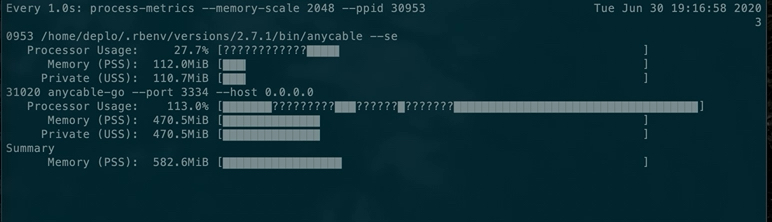
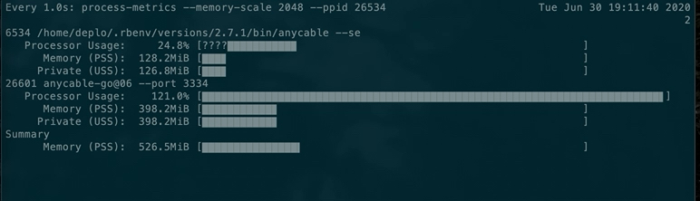
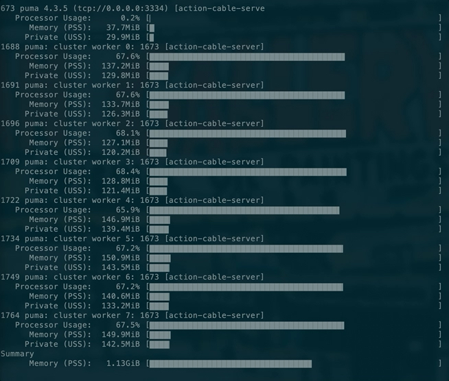
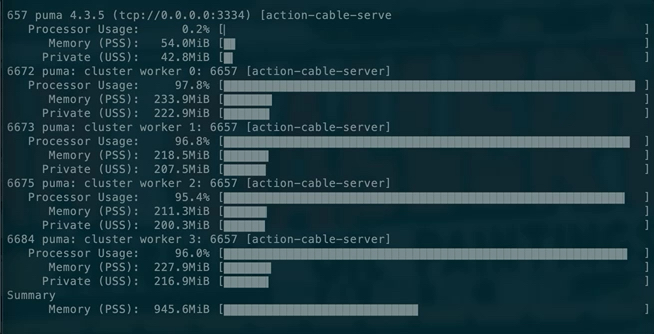
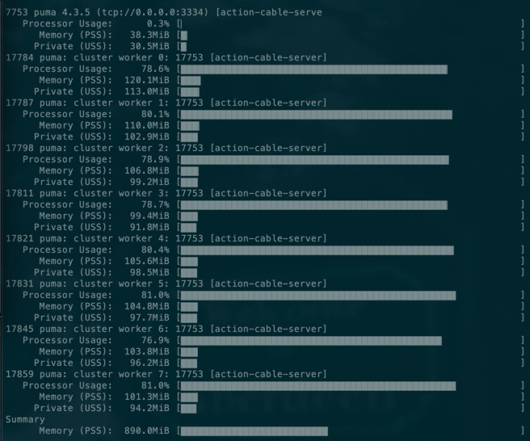
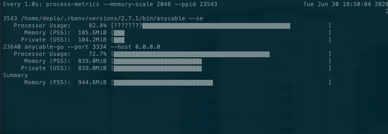
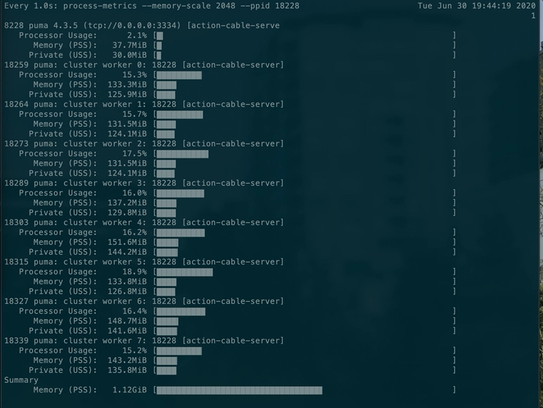

# WebSocket Shootout Benchmark (2020-06-30)

**Source code**: [websoocket-shootout](https://github.com/anycable/websocket-shootout)
**Machine**: AWS EC2 c3.2xlarge (8 vCPU, 15 GiB RAM) (one for WS servers and another one for benchmark CLI)
**Ruby**: 2.7.1p57 (2018-03-29 revision 63029)
**Rails**: 6.0.3

Benchmarks were made using [websocket-bench](https://github.com/anycable/websocket-bench).

Memory and CPU usage is tracked via the [process-metrics](https://github.com/socketry/process-metrics) gem.

**NOTE:** We use a minimal Rails application for benchmarks. It only consumes 20MiB on load, while most real-life Rails application require hundreds. We should take into account the fact that memory is (partially) duplicated between processes during the application lifecycle (see, for example,  [The Limits of Copy-on-write](https://brandur.org/ruby-memory))). Thus, the memory usage of a multi-process web server (such as Puma) also depends on that, not only on the number of connections we want to handle.

## Broadcast RTT

The benchmark measures broadcasting RTT for 10k clients and the corresponding memory/CPU usage.

Benchmark command:

```sh
websocket-bench broadcast <url> \
  --concurrent 8 \
  --sample-size 100 \
  --step-size 1000 \
  --payload-padding 200 \
  --total-steps 10 \
  --origin http://0.0.0.0 \
  --server-type=actioncable
```

### AnyCable v1.0

```txt
clients:  1000    95per-rtt: 196ms    min-rtt:   2ms    median-rtt:  33ms    max-rtt: 252ms
clients:  2000    95per-rtt: 296ms    min-rtt:   2ms    median-rtt:  48ms    max-rtt: 596ms
clients:  3000    95per-rtt: 462ms    min-rtt:   2ms    median-rtt: 101ms    max-rtt: 694ms
clients:  4000    95per-rtt: 670ms    min-rtt:   3ms    median-rtt:  72ms    max-rtt: 1382ms
clients:  5000    95per-rtt: 712ms    min-rtt:   3ms    median-rtt: 101ms    max-rtt: 1526ms
clients:  6000    95per-rtt: 739ms    min-rtt:   3ms    median-rtt:  99ms    max-rtt: 2901ms
clients:  7000    95per-rtt: 745ms    min-rtt:   2ms    median-rtt: 231ms    max-rtt: 2800ms
clients:  8000    95per-rtt: 950ms    min-rtt:   2ms    median-rtt: 173ms    max-rtt: 3109ms
clients:  9000    95per-rtt: 1133ms   min-rtt:   3ms    median-rtt: 185ms    max-rtt: 4084ms
clients: 10000    95per-rtt: 1033ms   min-rtt:   3ms    median-rtt: 248ms    max-rtt: 2671ms
```



### AnyCable v0.6

```txt
clients:  1000    95per-rtt: 611ms    min-rtt:   1ms    median-rtt:  14ms    max-rtt: 678ms
clients:  2000    95per-rtt: 422ms    min-rtt:   2ms    median-rtt:  36ms    max-rtt: 999ms
clients:  3000    95per-rtt: 617ms    min-rtt:   2ms    median-rtt:  62ms    max-rtt: 975ms
clients:  4000    95per-rtt: 620ms    min-rtt:   2ms    median-rtt:  54ms    max-rtt: 744ms
clients:  5000    95per-rtt: 855ms    min-rtt:   2ms    median-rtt:  79ms    max-rtt: 1428ms
clients:  6000    95per-rtt: 837ms    min-rtt:   2ms    median-rtt:  99ms    max-rtt: 1595ms
clients:  7000    95per-rtt: 1266ms   min-rtt:   4ms    median-rtt:  97ms    max-rtt: 3011ms
clients:  8000    95per-rtt: 1122ms   min-rtt:   2ms    median-rtt: 110ms    max-rtt: 2968ms
clients:  9000    95per-rtt: 1434ms   min-rtt:   4ms    median-rtt: 171ms    max-rtt: 3077ms
clients: 10000    95per-rtt: 1998ms   min-rtt:   2ms    median-rtt: 102ms    max-rtt: 2717ms
```



### Action Cable + Puma (8 workers)

```txt
clients:  1000    95per-rtt: 1181ms    min-rtt:   1ms    median-rtt: 658ms     max-rtt: 1774ms
clients:  2000    95per-rtt: 2053ms    min-rtt:   1ms    median-rtt: 1261ms    max-rtt: 2773ms
clients:  3000    95per-rtt: 3982ms    min-rtt:   2ms    median-rtt: 1744ms    max-rtt: 5855ms
clients:  4000    95per-rtt: 5710ms    min-rtt:   3ms    median-rtt: 2295ms    max-rtt: 6801ms
clients:  5000    95per-rtt: 5175ms    min-rtt:   3ms    median-rtt: 3329ms    max-rtt: 5653ms
clients:  6000    95per-rtt: 8175ms    min-rtt:   1ms    median-rtt: 3922ms    max-rtt: 9352ms
clients:  7000    95per-rtt: 8580ms    min-rtt:   2ms    median-rtt: 4720ms    max-rtt: 9496ms
clients:  8000    95per-rtt: 8008ms    min-rtt:   1ms    median-rtt: 5303ms    max-rtt: 9523ms
clients:  9000    95per-rtt: 11203ms   min-rtt:   1ms    median-rtt: 5529ms    max-rtt: 12432ms
clients: 10000    95per-rtt: 9758ms    min-rtt:   2ms    median-rtt: 7127ms    max-rtt: 11997ms
```



### Action Cable + Puma (4 workers)

```txt
clients:  1000    95per-rtt: 1310ms     min-rtt:   3ms    median-rtt: 751ms     max-rtt: 1516ms
clients:  2000    95per-rtt: 4280ms     min-rtt:   4ms    median-rtt: 1121ms    max-rtt: 5098ms
clients:  3000    95per-rtt: 4186ms     min-rtt:   2ms    median-rtt: 2469ms    max-rtt: 4732ms
clients:  4000    95per-rtt: 6396ms     min-rtt:   2ms    median-rtt: 3133ms    max-rtt: 7453ms
clients:  5000    95per-rtt: 9266ms     min-rtt:   4ms    median-rtt: 4203ms    max-rtt: 10557ms
clients:  6000    95per-rtt: 7345ms     min-rtt:   1ms    median-rtt: 5404ms    max-rtt: 8175ms
clients:  7000    95per-rtt: 18103ms    min-rtt:   2ms    median-rtt: 4161ms    max-rtt: 20640ms
clients:  8000    95per-rtt: 15128ms    min-rtt:   2ms    median-rtt: 5443ms    max-rtt: 16586ms
clients:  9000    95per-rtt: 11267ms    min-rtt:   2ms    median-rtt: 7442ms    max-rtt: 13711ms
clients: 10000    95per-rtt: 18683ms    min-rtt:   2ms    median-rtt: 8089ms    max-rtt: 20381ms
```



### Action Cable + Puma (8 workers) + MALLOC_ARENA_MAX=2

```txt
clients:  1000    95per-rtt: 1547ms    min-rtt:   1ms    median-rtt: 504ms     max-rtt: 1665ms
clients:  2000    95per-rtt: 2541ms    min-rtt:   1ms    median-rtt: 1153ms    max-rtt: 2586ms
clients:  3000    95per-rtt: 4537ms    min-rtt:   1ms    median-rtt: 1878ms    max-rtt: 5413ms
clients:  4000    95per-rtt: 4561ms    min-rtt:   1ms    median-rtt: 2657ms    max-rtt: 5787ms
clients:  5000    95per-rtt: 6910ms    min-rtt:   1ms    median-rtt: 2751ms    max-rtt: 7925ms
clients:  6000    95per-rtt: 6892ms    min-rtt:   1ms    median-rtt: 3842ms    max-rtt: 7547ms
clients:  7000    95per-rtt: 9967ms    min-rtt:   1ms    median-rtt: 4036ms    max-rtt: 12142ms
clients:  8000    95per-rtt: 13131ms   min-rtt:   1ms    median-rtt: 4442ms    max-rtt: 14234ms
clients:  9000    95per-rtt: 10343ms   min-rtt:   1ms    median-rtt: 6043ms    max-rtt: 11079ms
clients: 10000    95per-rtt: 9986ms    min-rtt:   2ms    median-rtt: 6980ms    max-rtt: 15125ms
```



## Connection avalanche

The benchmark measures the resources usage and connection time in case when tons of clients (in our case 20k) try to connect at the same time.

The benchmark command as follows:

```sh
bench$ websocket-bench connect <url> \
  --concurrent 2000 \
  --step-size 10000 \
  --total-steps 2 \
  --server-type=actioncable-connect
```

**NOTE:** By "connection" we mean a succesfully initialized Action Cable consumer with a channel subscription (this, it's not a WebSocket connection, but also a channel subscription).

### AnyCable 1.0

```txt
clients: 20000    95per-rtt: 1944ms    min-rtt:   3ms    median-rtt: 1253ms    max-rtt: 2583ms
```

**NOTE:** AnyCable connection time is affected RPC latency and concurrency limits. For this benchmarks the following configuration options were used: `ANYCABLE_RPC_POOL_SIZE=60 ANYCABLE_RPC_CONCURRENCY=50`.



### Action Cable + Puma (8 workers)

```txt
clients: 18024    95per-rtt: 912ms    min-rtt:   9ms    median-rtt: 281ms    max-rtt: 3327ms
```

**NOTE:** 10% of clients failed to connect.


