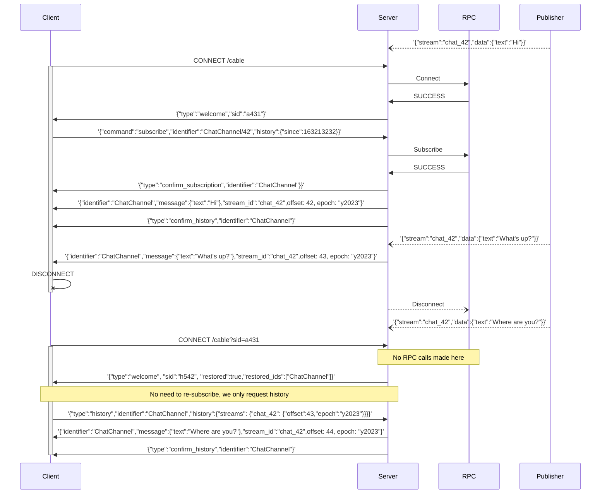
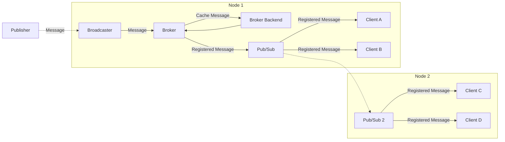

# Streams History (Broker)

AnyCable v1.4 introduced a new major concept of a **broker**. It's responsible for providing better consistency guarantees for AnyCable real-time applications.

Current status: **experimental**.

_The experimental status is due to the fact that the in-memory broker cache implementation is currently available. Distributed/persistent broker adapters will be added in the future versions. The API may slightly change in the future (more likely, extended to support more use cases)._

## Overview

Broker implements features that can be characterized as _hot cache utilities_:

- Handling incoming broadcast messages and storing them in a cache—that could help clients to receive missing broadcasts (triggered while the client was offline, for example).
- Persisting client states—to make it possible to restore on re-connection (by providing a _session id_ of the previous connection).

Below you can see the diagram demonstrating how clients can you these features to keep up with the stream messages:



To support these features, an [extended Action Cable protocol](/misc/action_cable_protocol.md#action-cable-extended-protocol) is used for communication.

You can use [AnyCable JS client](https://github.com/anycable/anycable-client) library at the client-side to use the extended protocol.

## Usage

By default, broker is disabled. To enable it, you need to provide the `--broker` option with a broker adapter name:

```sh
$ anycable-go --broker=memory

INFO 2023-04-14T00:31:55.548Z context=main Starting AnyCable 1.3.1-d8939df (with mruby 1.2.0 (2015-11-17)) (pid: 87410, open file limit: 122880, gomaxprocs: 8)
INFO 2023-04-14T00:31:55.548Z context=main Using in-memory broker (epoch: vRXl, history limit: 100, history ttl: 300s, sessions ttl: 300s)
...
```

With broker enabled in an AnyCable-Go cluster, you MUST use a non-distributed, single-node broadcaster (currently, only `http`). Otherwise, different nodes will have different IDs for the same messages and using cache will be impossible.

To re-transmit _registered_ messages within a cluster, you MUST also configure a pub/sub adapter (via the `--pubsub` option).

The overall broadcasting message flow looks as follows:



To sum up, to enable broker features, you must configure:

- `--broker` option with a broker adapter name
- `--pubsub` option with a pub/sub adapter name
- `--broadcaster` option with a compatible broadcasting adapters (currently, only `http`).

## Configuration

Broker provides several common configuration options to control how to store messages and sessions:

- `--history_limit`: Max number of messages to keep in the stream's history. Default: `100`.
- `--history_ttl`: Max time to keep messages in the stream's history. Default: `300s`.
- `--sessions_ttl`: Max time to keep sessions in the cache. Default: `300s`.

Currently, the configuration is global. We plan to add support for granular (per-stream) for messages history in the following releases.

## Storage adapters

### Memory

The default broker adapter. It stores all data in memory. It can be used for single node installations, and it's a primary option for development and testing purposes.

Since the data is stored in memory, it's getting lost during restarts.

**NOTE:** Storing data in memory can noticeably increase the overall RAM usage of an AnyCable-Go process.

### Redis

<p class="pro-badge-header"></p>

Coming soon ⏳
