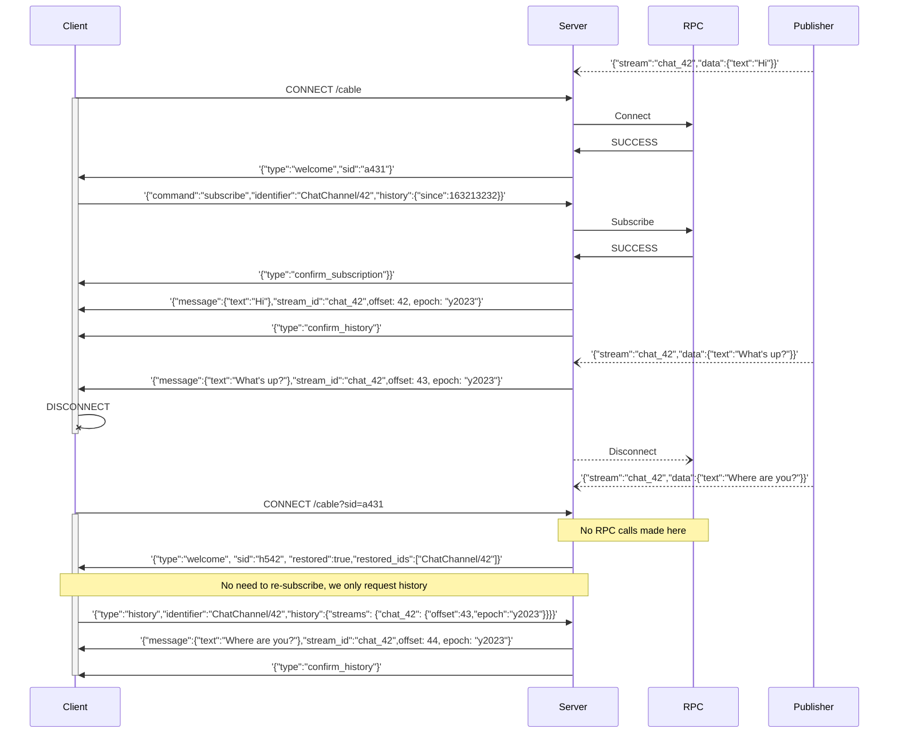
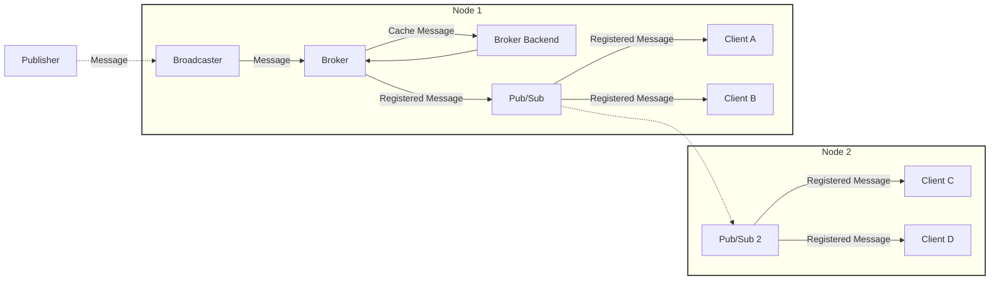

# Broker deep dive

Broker is a component of AnyCable-Go responsible for keeping streams and sessions information in a cache-like storage. It drives the [Reliable Streams](./reliable_streams.md) feature.

Broker implements features that can be characterized as _hot cache utilities_:

- Handling incoming broadcast messages and storing them in a cache—that could help clients to receive missing broadcasts (triggered while the client was offline, for example).
- Persisting client states—to make it possible to restore on re-connection (by providing a _session id_ of the previous connection).

## Client-server communication

Below you can see the diagram demonstrating how clients can you the broker-backed features to keep up with the stream messages and restore their state:

To support these features, an [extended Action Cable protocol](/misc/action_cable_protocol.md#action-cable-extended-protocol) is used for communication.

You can use [AnyCable JS client](https://github.com/anycable/anycable-client) library at the client-side to use the extended protocol.

## Broadcasting messages

Broker is responsible for **registering broadcast messages**. Each message MUST be registered once; thus, we MUST you a broadcasting method which publishes messages to a single node in a cluster (see [Broadcast adapters](../ruby/broadcast_adapters.md)). Currently, `http` and `redisx` adapters are supported.

**NOTE:** When legacy adapters are used, enabling a broker has no effect.

To re-transmit registered messages within a cluster, we need a pub/sub component. See [Pub/Sub](./pubsub.md) for more information.

The overall broadcasting message flow looks as follows:

