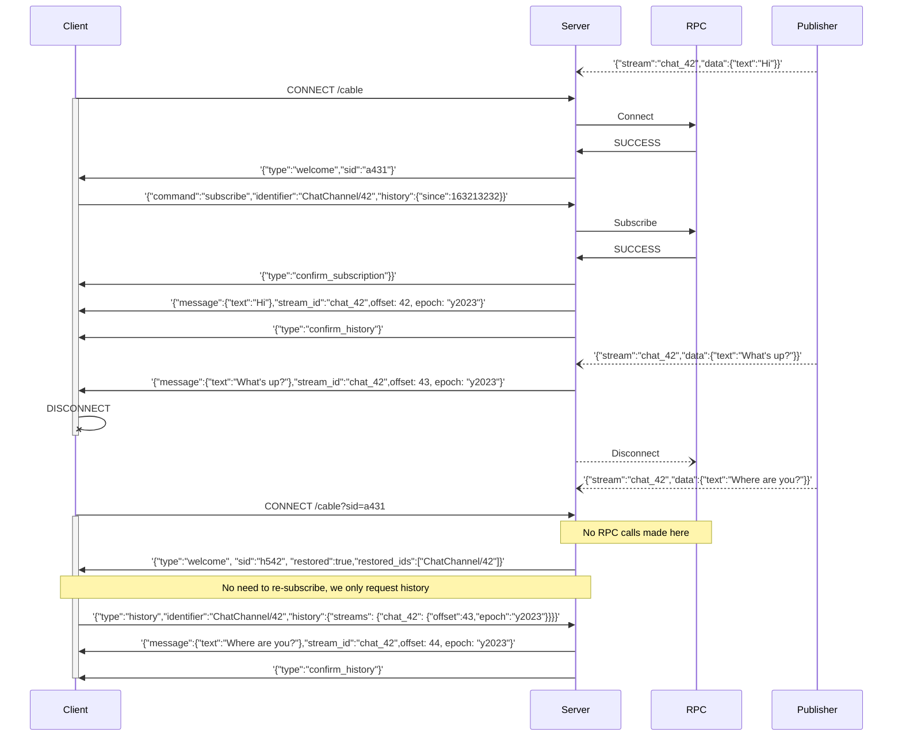
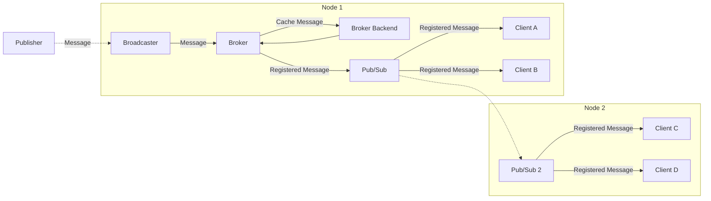

# Streams History (Broker)

AnyCable v1.4 introduced a new major concept of a **broker**. It's responsible for providing better consistency guarantees for AnyCable real-time applications.

> 🎥 Learn more about the consistency pitfalls of Action Cable from [The pitfalls of realtime-ification](https://noti.st/palkan/MeBUVe/the-pitfalls-of-realtime-ification) talk (RailsConf 2022).

Current status: **experimental**.

_The experimental status is due to the fact that the in-memory broker cache implementation is currently available. Distributed/persistent broker adapters will be added in the future versions. The API may slightly change in the future (more likely, extended to support more use cases)._

## Overview

Broker implements features that can be characterized as _hot cache utilities_:

- Handling incoming broadcast messages and storing them in a cache—that could help clients to receive missing broadcasts (triggered while the client was offline, for example).
- Persisting client states—to make it possible to restore on re-connection (by providing a _session id_ of the previous connection).

## Quick start

The easiest way to try the streams history feature is to use the `try-broker` preset for AnyCable-Go:

```sh
$ anycable-go --presets=try-broker

INFO 2023-04-14T00:31:55.548Z context=main Starting AnyCable 1.4.0-d8939df (with mruby 1.2.0 (2015-11-17)) (pid: 87410, open file limit: 122880, gomaxprocs: 8)
INFO 2023-04-14T00:31:55.548Z context=main Using in-memory broker (epoch: vRXl, history limit: 100, history ttl: 300s, sessions ttl: 300s)
INFO 2023-04-18T20:46:00.693Z context=pubsub Starting Redis pub/sub: localhost:6379
INFO 2023-04-19T16:22:55.776Z context=pubsub provider=http Accept broadcast requests at http://localhost:8090/_broadcast
...
```

**IMPORTANT:** Use v1.4.0-rc.1 or higher to try the broker (e.g., `anycable/anycable-go:1.4.0-rc.1` Docker image).

**NOTE:** The preset assumes that you use Redis as a pub/sub component. If you use a different pub/sub adapter, you need to provide the `--pubsub` option with the adapter name.

Now, at the Ruby/Rails side, switch to the `http` broadcasting adapter. For example, in `config/anycable.yml`:

```yaml
default: &default
  # ...
  broadcast_adapter: http
```

Finally, at the client-side, you MUST use the [AnyCable JS client](https://github.com/anycable/anycable-client) and configure it to use the `actioncable-v1-ext-json` protocol:

```js
import { createCable } from '@anycable/web'
// or for non-web projects
// import { createCable } from '@anycable/core'

export default createCable({protocol: 'actioncable-v1-ext-json'})
```

That's it! Now your clients will automatically catch-up with the missed messages and restore their state on re-connection.

## How it works

Below you can see the diagram demonstrating how clients can you the broker features to keep up with the stream messages and restore their state:



To support these features, an [extended Action Cable protocol](/misc/action_cable_protocol.md#action-cable-extended-protocol) is used for communication.

You can use [AnyCable JS client](https://github.com/anycable/anycable-client) library at the client-side to use the extended protocol.

## Manual setup

The `try-broker` preset is good for a quick start. Let's see how to configure the broker and other components manually.

First, you need to provide the `--broker` option with a broker adapter name:

```sh
$ anycable-go --broker=memory

INFO 2023-04-14T00:31:55.548Z context=main Starting AnyCable 1.4.0-d8939df (with mruby 1.2.0 (2015-11-17)) (pid: 87410, open file limit: 122880, gomaxprocs: 8)
INFO 2023-04-14T00:31:55.548Z context=main Using in-memory broker (epoch: vRXl, history limit: 100, history ttl: 300s, sessions ttl: 300s)
...
```

With broker enabled in an AnyCable-Go cluster, you MUST use a non-distributed, single-node broadcaster (currently, `http` and `redisx` are available). Otherwise, different nodes will have different IDs for the same messages and using cache will be impossible. See [Broadcast adapters](/ruby/broadcast_adapters.md) for more information.

To re-transmit _registered_ messages within a cluster, you MUST also configure a pub/sub adapter (via the `--pubsub` option). See [Pub/Sub documentation](./pubsub.md) for available options.

The overall broadcasting message flow looks as follows:



To sum up, to enable broker features, you must configure:

- `--broker` option with a broker adapter name
- `--pubsub` option with a pub/sub adapter name
- `--broadcaster` option with a compatible broadcasting adapters (`http` or `redisx`).

## Configuration

Broker provides several common configuration options to control how to store messages and sessions:

- `--history_limit`: Max number of messages to keep in the stream's history. Default: `100`.
- `--history_ttl`: Max time to keep messages in the stream's history. Default: `300s`.
- `--sessions_ttl`: Max time to keep sessions in the cache. Default: `300s`.

Currently, the configuration is global. We plan to add support for granular (per-stream) for messages history in the following releases.

## Storage adapters

### Memory

The default broker adapter. It stores all data in memory. It can be used **only for single node installations**. So, it's perfect for development and testing as well as applications having just a single WebSocket server.

**IMPORTANT**: Since the data is stored in memory, it's getting lost during restarts.

**NOTE:** Storing data in memory may result into the increased RAM usage of an AnyCable-Go process.

### Redis

<p class="pro-badge-header"></p>

Coming soon ⏳
