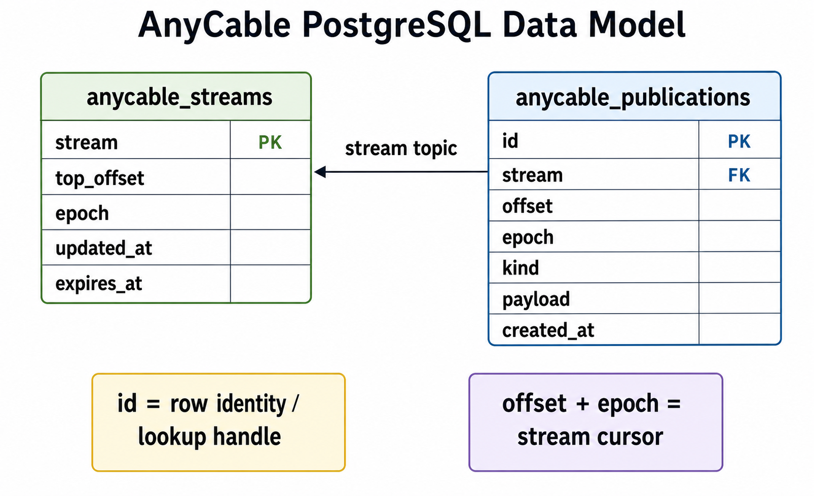
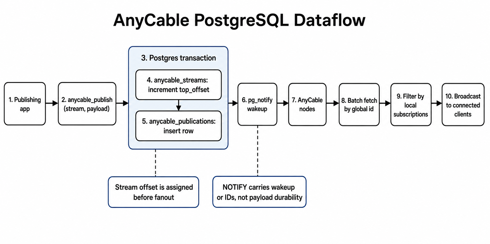

# PostgreSQL Signalling Implementation Plan

This document captures the proposed direction for the PostgreSQL signalling PR.
It uses the following vocabulary:

- A stream is a named topic, not a worker.
- A publication is one event for one stream.
- `publication.id` is a durable row identity and optional lookup handle, not a stream position.
- `publication.offset` plus `publication.epoch` is the stream-local position used for history and recovery semantics.
- `NOTIFY` carries the updated stream name as a wakeup signal; durable payload data lives in PostgreSQL.

## Target Shape

- Replace separate PostgreSQL broadcast and pub/sub tables with one canonical publication table plus one stream metadata table.
- Keep PostgreSQL schema ownership in AnyCable Go, with automatic schema actualization enabled by default whenever a PostgreSQL-backed component is active.
- Have publishing applications write through SQL functions, not raw table inserts.
- Avoid claiming publication rows for pub/sub fanout. Publications are topic events, so every AnyCable node may observe the same row and locally forward it to matching subscribers.
- Keep the schema compatible with a future PostgreSQL broker, but do not claim full broker/history support until `HistoryFrom`, `HistorySince`, and `Peak` are implemented on top of the PostgreSQL tables.

## Data Model



```text
anycable_streams
  stream text primary key
  top_offset bigint not null default 0
  epoch text not null
  created_at timestamptz
  updated_at timestamptz
  expires_at timestamptz optional

anycable_publications
  id bigserial primary key
  stream text not null references anycable_streams(stream)
  offset bigint not null
  epoch text not null
  kind smallint not null default 0
  payload jsonb/text not null
  meta jsonb optional
  created_at timestamptz not null default now()
```

Primary indexes:

- `anycable_publications(id)` for row identity and optional direct lookups.
- `anycable_publications(stream, epoch, offset)` for changed-stream catch-up, history, and broker reads.
- `anycable_publications(created_at)` for cleanup.
- `anycable_streams(expires_at)` if stream metadata expiry is supported.

Rollback semantics:

- Stream offsets should be transactional. If the publish transaction rolls back, the stream offset increment rolls back too.
- The global `id` may have gaps because it is backed by a PostgreSQL sequence. That is acceptable because it is only row identity, not a stream position.

## Dataflow



1. A publishing application calls `anycable_publish(stream, payload, meta)`.
2. PostgreSQL upserts and locks the `anycable_streams` row for the stream.
3. PostgreSQL increments `top_offset` and inserts a canonical `anycable_publications` row with `(stream, offset, epoch, payload)`.
4. PostgreSQL sends `pg_notify` with the updated stream name, signalling that nodes interested in that stream should catch up.
5. AnyCable nodes wake and check whether the stream is locally subscribed.
6. Interested nodes batch-fetch new publication rows for changed subscribed streams by stream-local position.
7. Each node advances its observed cursor for the fetched stream.
8. Connected clients receive the publication with stream-local `offset` and `epoch`.

## SQL Functions

`anycable_publish(stream, payload, meta default '{}')` should:

- Upsert or lock `anycable_streams[stream]`.
- Increment that stream's `top_offset` in the same transaction.
- Insert one `anycable_publications` row.
- Call `pg_notify` with the stream name.
- Return `(id, stream, offset, epoch)`.

`anycable_remote_command(payload, meta default '{}')` should:

- Use the same publication table.
- Mark rows with `kind = remote_command`, likely on the internal stream.
- Reuse the same wakeup and batch-fetch path.

## Go Adapter Changes

- Move schema rendering and verification into the `postgres` package.
- Automatically create or actualize the PostgreSQL schema when a PostgreSQL-backed component is active.
- Add a concise opt-out flag, for example `--disable-postgres-schema-check`, for deployments that manage schema separately.
- Fail startup when PostgreSQL schema checking is enabled and required tables, functions, or indexes are missing or incompatible.
- Rework PostgreSQL pub/sub polling around coalesced changed-stream catch-up:

```sql
SELECT id, stream, offset, epoch, kind, payload
FROM anycable_publications
WHERE stream = $1
  AND epoch = $2
  AND offset > $3
ORDER BY offset
LIMIT $4;
```

- Maintain the local subscription map in Go.
- Treat `NOTIFY` payloads as stream names. A notification means "this stream changed recently; catch up if this node is subscribed."
- Coalesce pending stream names and batch-fetch changed subscribed streams instead of polling every subscribed stream. The single-stream query above can be generalized with a `VALUES` list of `(stream, epoch, offset)` cursors.
- Track observed position per stream, using `offset` and `epoch`.
- Ignore notifications for streams with no local subscribers.
- Avoid passing already-positioned publications through broker paths that overwrite `Offset` and `Epoch`.

## Ruby and Rails Changes

- `anycable-rb`: replace raw inserts with calls to `anycable_publish(...)` and `anycable_remote_command(...)`.
- `anycable-rails`: remove ownership of PostgreSQL schema migrations.
- Documentation should tell publishing applications that SQL functions are the public integration point and table layout is server-owned.

## Validation Plan

Schema and function tests:

- Schema creation is idempotent.
- Schema actualization runs automatically when PostgreSQL-backed components are active.
- `--disable-postgres-schema-check` skips automatic schema creation/modification for externally managed schemas.
- Startup fails when schema checking is enabled and the database schema is missing or mismatched.
- Validation fails clearly when a required table, function, or index is missing or incompatible.
- Invalid table names or prefixes are rejected before SQL execution.
- `anycable_publish` creates stream metadata lazily.
- Same-stream publishes produce offsets `1, 2, 3`.
- Different streams each start at offset `1`.
- Concurrent same-stream publishes produce unique contiguous offsets.
- A rolled-back publish leaves no committed publication and no committed stream offset gap.
- The publish function returns the row `id` plus stream position.

Pub/sub behavior tests:

- The hot path does not query once for every subscribed stream.
- `NOTIFY` payloads include stream names so each node can check whether that stream is locally subscribed before fetching.
- A node subscribed to `stream_a` fetches and receives only `stream_a` rows when `stream_a` is notified.
- Notifications for unsubscribed streams do not trigger publication fetches.
- Multiple changed subscribed streams can be coalesced into a bounded batch of catch-up reads.
- Two nodes both receive the same publication when both are subscribed.
- Repeated wakeups or ticks do not duplicate delivery.
- Late subscription starts from the current tail unless a PostgreSQL broker/history mode is implemented.
- Remote command rows route through command handling, not stream broadcast handling.
- Cleanup removes old publication rows without breaking cursor behavior for active nodes.

Integration and regression tests:

- Add PostgreSQL-backed CI coverage for the Go adapter tests.
- Run targeted suites first:
  - `go test ./postgres`
  - `go test ./pubsub -run Postgres`
  - `go test ./broadcast -run Postgres`
  - `go test ./broker ./node`
- Run broader `go test ./...` once the targeted suites pass.
- Ruby-side tests should assert publishing calls SQL functions, not raw table inserts.

## Maintainer Decision Gates

- Should this PR convert PostgreSQL broadcasting into fanout-style delivery now, or keep a smaller transitional adapter?
- Should `anycable_publications.payload` be `jsonb`, `text`, or configurable?
- Is broker/history support explicitly out of scope for this PR, with the schema prepared for it later?
