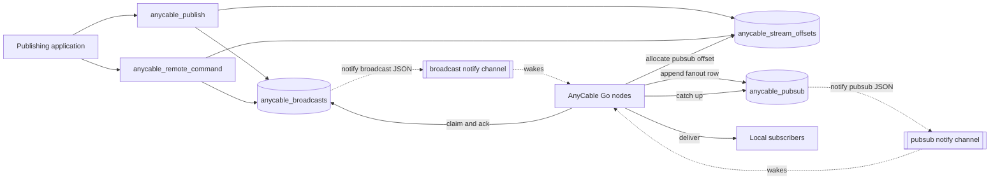
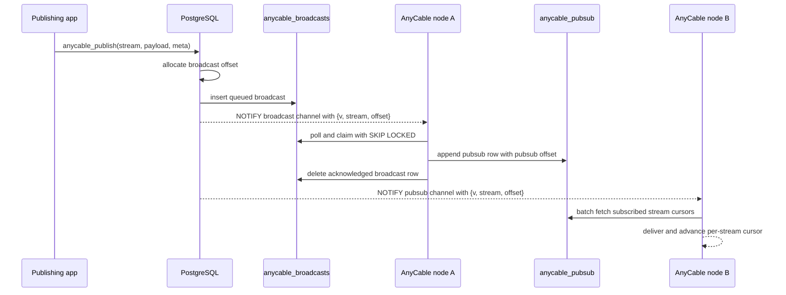

# PostgreSQL Signalling Implementation Plan

This document captures the proposed direction for the PostgreSQL signalling PR.
All PostgreSQL signalling code in this PR is new to AnyCable, so the goal is a
clean final shape rather than preserving the first local implementation.

## Design Stance

- Polling is the source of truth. `LISTEN/NOTIFY` only wakes polling loops and
  never carries durable delivery payloads.
- Do not create one PostgreSQL `LISTEN` channel per stream. Use two stable
  wake-up channels:
  - app-to-server broadcasts: `postgres_broadcast_notify_channel`, default
    `anycable_broadcasts`;
  - node-to-node fanout: `postgres_pubsub_notify_channel`, default
    `anycable_pubsub`.
- This document uses the `postgres_*` field names for clarity. In TOML, these
  are nested under `[postgres]` as `broadcast_notify_channel` and
  `pubsub_notify_channel`; the environment variables are
  `ANYCABLE_POSTGRES_BROADCAST_NOTIFY_CHANNEL` and
  `ANYCABLE_POSTGRES_PUBSUB_NOTIFY_CHANNEL`.
- Treat app-to-server broadcasts and node-to-node fanout as two logical links
  with different delivery semantics.
- Both wake-up links use JSON text payloads with version, stream, and latest
  offset: `{"v":1,"stream":"stream-name","offset":123}`. The offset scope is
  `broadcast` for app-to-server queue notifications and `pubsub` for
  node-to-node fanout notifications.
- Notifications are emitted by PostgreSQL as part of the SQL work that inserts
  the corresponding row. Go code may initiate the SQL, but listeners should
  treat PostgreSQL as the notification source and polling as the correctness
  mechanism.
- Use per-stream offsets for ordering and cursors. Auto-increment IDs may exist
  as internal row identifiers if implementation needs them, but delivery order,
  catch-up cursors, and public SQL function return values should be based on
  `(stream, offset)`.
- Keep this PR focused on signalling. Broker/history support can use the same
  offset model later, but this PR should not claim `HistoryFrom`,
  `HistorySince`, or `Peak` support.
- Guarantee ordering per stream, not globally across unrelated streams.

## Target Shape



### Server-owned schema

AnyCable Go owns the schema required by PostgreSQL-backed components:

- create or actualize the schema automatically when a PostgreSQL-backed
  component is active;
- fail startup if schema management is enabled and the schema cannot be created
  or validated;
- provide `postgres_ensure_schema` as the proposed concise opt-out flag for
  deployments that manage schema externally;
- keep publishing applications behind SQL functions instead of requiring them
  to know table layouts.

The first version should actualize the full PostgreSQL signalling schema when
any PostgreSQL-backed signalling component is active. This keeps setup simple
and avoids a partial-schema matrix across broadcast, pub/sub, and SQL function
objects.

No schema marker table is required for the first version. Startup should run
idempotent, non-destructive DDL for the required tables, indexes, triggers, and
SQL functions, then interrogate PostgreSQL catalogs to validate the resulting
shape.

The proposed flag follows the existing `postgres_*` configuration convention:
`--postgres_ensure_schema=false` skips DDL creation/actualization. Startup still
interrogates PostgreSQL catalogs and fails when the schema shape is
incompatible.

The opt-out flag only disables creation and modification. If any required
table, index, trigger, or function is missing when `postgres_ensure_schema=false`
is configured, startup should fail with a clear validation error. This matches
the maintainer request that an active PostgreSQL-backed component must not run
against a missing or mismatched schema.

Schema actualization should create missing objects and add missing compatible
columns, indexes, triggers, and functions. It should fail rather than apply a
destructive or ambiguous migration when an existing object has an incompatible
type, nullability contract, uniqueness contract, function signature, or trigger
shape.

### Offset metadata

Per-stream offsets require a small metadata table so offsets do not reset after
retention cleanup removes old delivery rows:

- `anycable_stream_offsets` stores the latest allocated offset per logical
  scope and stream;
- the primary key is `(scope, stream)`;
- known first-version scopes are `broadcast` and `pubsub`;
- allocation is transactional and atomic, using an upsert that increments the
  offset row and returns the new value.

One possible allocation shape:

```sql
INSERT INTO anycable_stream_offsets (scope, stream, offset)
VALUES ($1, $2, 1)
ON CONFLICT (scope, stream)
DO UPDATE SET offset = anycable_stream_offsets.offset + 1,
              updated_at = now()
RETURNING offset;
```

The offset increment and delivery-row insert should happen in the same
transaction. If the transaction rolls back, the offset increment rolls back too,
so successful publications keep contiguous per-stream offsets without relying on
global auto-increment IDs.

The metadata table is part of delivery semantics, unlike the removed schema
contract table. If a future broker/history implementation merges the delivery
links into a single publication source of truth, it can reuse the same
stream-offset model instead of translating from global row IDs.

### App-to-server queue

`anycable_broadcasts` is a single-consumer queue for publications created by
applications:

- rows include `stream` and `offset` as first-class columns;
- `(stream, offset)` is unique;
- payload and metadata columns are `text`;
- AnyCable nodes poll with `FOR UPDATE SKIP LOCKED`;
- exactly one node claims and processes a row;
- successful rows are acknowledged by deleting the queue row;
- failed rows are released for retry or left with failure details after attempts
  are exhausted;
- the behavior for exhausted rows is controlled by
  `postgres_exhausted_broadcast_policy`;
- `NOTIFY` only wakes nodes after inserts;
- notification payloads are JSON text with version, stream, and latest
  `broadcast` offset: `{"v":1,"stream":"stream-name","offset":123}`.

This keeps the current broadcaster shape, but makes stream ordering visible to
SQL and avoids the rollback-gap/global-ID concerns of auto-increment cursors.

`postgres_exhausted_broadcast_policy` should support:

- `skip`: keep failure details for inspection, but unblock later same-stream
  rows after the older row exhausts attempts;
- `block`: keep the exhausted row as an ordering barrier until an operator
  resolves or removes it.

`skip` is the pragmatic default because it avoids one poison row stopping a
stream forever. `block` is available for deployments that prefer strict
same-stream sequence handling after unrecoverable failures.

Retriable failures should release the claim by clearing `claimed_by` and
`claimed_at`, while preserving the failure details needed for the next attempt.
Exhausted failures should keep inspection metadata, including `claimed_by`,
`claimed_at`, attempts, and the last error. The exhausted-row policy decides only
whether later same-stream rows can proceed; it does not erase inspection state.

Cleanup should respect the policy:

- successful rows are already deleted by ack and do not participate in cleanup;
- `skip` rows may be cleaned after the retention window;
- `block` rows should not be removed by automatic cleanup, because removal is
  the operator action that unblocks later same-stream rows.

There is no retained terminal-success state in the first version. Keeping only
unfinished or failed broadcast rows makes the same-stream ordering predicate
simple: older rows block later offsets only while they are still unacknowledged
and either retriable or exhausted under the `block` policy.

### Node-to-node fanout log

`anycable_pubsub` is a fanout catch-up log:

- each interested AnyCable node may read the same row;
- rows include `stream` and `offset` as first-class columns;
- `(stream, offset)` is unique;
- rows are fetched by stream cursor, not claimed;
- notification payloads are JSON text with version, stream, and latest offset:
  `{"v":1,"stream":"stream-name","offset":123}`;
- the offset in the notification payload is a latency/logging hint only;
  correctness must come from polling by local cursor;
- nodes ignore notifications for streams with no local subscribers;
- wakeups can be coalesced before querying;
- fallback ticks batch all subscribed stream cursors instead of issuing one
  query per stream.

This keeps PostgreSQL from acting like Redis with thousands of dynamic
`LISTEN`s, while still avoiding the current N-per-stream polling loop.

Fanout rows are server-produced. If a node encounters a malformed fanout payload,
it should log and advance past that row rather than repeatedly blocking the
stream on a poison row. Cursor advancement should happen only after a terminal
handling outcome: delivered, ignored because the stream is no longer subscribed,
or logged-and-dropped as malformed.

## Dataflow



1. A publishing application calls `anycable_publish(stream, payload, meta)`.
   Remote commands follow the same app-to-server path through
   `anycable_remote_command(payload, meta)`, using the configured internal
   stream.
2. PostgreSQL transactionally allocates the next `broadcast` offset for the
   stream, inserts an `anycable_broadcasts` row, and sends a wake-up
   notification on `postgres_broadcast_notify_channel`.
3. AnyCable nodes poll the broadcast queue. The claim query uses
   `FOR UPDATE SKIP LOCKED` and only claims rows that have no older unfinished
   row for the same stream.
4. The winning node handles the broadcast through the broker path.
5. The broker writes a node-to-node fanout row to `anycable_pubsub`, allocating
   the next `pubsub` offset for the stream.
6. PostgreSQL sends a wake-up notification whose payload includes the stream
   name and latest offset on `postgres_pubsub_notify_channel`.
7. Nodes subscribed to that stream batch-fetch rows newer than their local
   cursor and deliver them in stream-offset order.
8. Periodic polling remains the correctness fallback if notifications are
   missed, delayed, or coalesced.

## Ordering Guarantee

The practical guarantee should be per-stream ordering. Global ordering across
unrelated streams is not required and would unnecessarily serialize work.

The app-to-server claim query should skip rows that have an older unfinished row
for the same stream. One possible shape:

```sql
WITH candidates AS (
  SELECT broadcasts.stream, broadcasts.offset
  FROM anycable_broadcasts broadcasts
  WHERE broadcasts.attempts < $attempts_limit
    AND (
      broadcasts.claimed_at IS NULL
      OR broadcasts.claimed_at < now() - ($claim_timeout::bigint * interval '1 second')
    )
    AND NOT EXISTS (
      SELECT 1
      FROM anycable_broadcasts older
      WHERE older.stream = broadcasts.stream
        AND older.offset < broadcasts.offset
        AND (
          older.attempts < $attempts_limit
          OR $exhausted_policy = 'block'
        )
    )
  ORDER BY broadcasts.created_at, broadcasts.stream, broadcasts.offset
  LIMIT $batch_limit
  FOR UPDATE SKIP LOCKED
)
UPDATE anycable_broadcasts AS broadcasts
SET claimed_by = $node_id,
    claimed_at = now(),
    attempts = broadcasts.attempts + 1,
    last_error = NULL
FROM candidates
WHERE broadcasts.stream = candidates.stream
  AND broadcasts.offset = candidates.offset
RETURNING broadcasts.stream, broadcasts.offset, broadcasts.payload, broadcasts.attempts;
```

This allows rows from different streams to be claimed in the same pass while
serializing rows for the same stream. If an older same-stream row exhausts its
attempts, the configured exhausted-row policy decides whether later rows may
proceed.

The query assumes successful rows are deleted during ack. If an implementation
chooses to retain successful rows later, it must add an explicit terminal status
and exclude terminal-success rows from the older-row guard.

This does not require one node to process different streams concurrently inside
the same polling loop. The required property is that different streams are not
blocked by each other's offsets or poison rows. Additional worker-level
parallelism can be added later if throughput requires it.

For node-to-node fanout, each node should serialize its own polling loop,
deliver rows ordered by `(stream, offset)`, and advance a stream cursor after
each terminal handling outcome. That preserves per-stream order locally without
requiring cross-stream ordering.

## Batched Fanout Polling

The current per-stream loop should be replaced by batched queries. Notify-driven
wakeups enqueue changed subscribed streams, so work is bounded by the changed
subset. Fallback ticks use all subscribed stream cursors, but still issue one
bounded batched query instead of one query per stream.

One possible shape:

```sql
WITH cursors AS (
  SELECT *
  FROM unnest($streams::text[], $offsets::bigint[]) AS c(stream, offset)
)
SELECT publications.stream, publications.offset, publications.payload
FROM cursors
JOIN LATERAL (
  SELECT offset, payload
  FROM anycable_pubsub
  WHERE stream = cursors.stream
    AND offset > cursors.offset
  ORDER BY offset
  LIMIT $per_stream_limit
) publications ON true
ORDER BY publications.stream, publications.offset;
```

The exact SQL can change during implementation, but the key property is that
AnyCable performs bounded catch-up for a set of streams in one database round
trip instead of one round trip per locally subscribed stream.

## SQL Functions

Publishing applications should call functions instead of inserting rows
directly:

- `anycable_publish(stream text, payload text, meta text default '{}') returns bigint`
- `anycable_remote_command(payload text, meta text default '{}') returns bigint`

The functions should:

- validate required inputs;
- allocate the next per-stream offset;
- insert into the app-to-server queue;
- trigger a wake-up notification;
- return the created `broadcast`-scope offset for observability.

There is no batch SQL function in the first version. Producers that batch at the
application API layer should decompose the batch into one SQL function call per
message. This matches the existing AnyCable path where batches are decomposed
before broker/pub-sub delivery and keeps the SQL contract narrow.

Payload and metadata columns should be `text`. The payload is an opaque
serialized AnyCable message; routing and queue behavior should rely on explicit
columns such as `stream`, `offset`, and claim state, not SQL inspection of the
payload body. If future broker/history work needs structured metadata, add
separate metadata columns rather than making the main payload `jsonb`.

`anycable_remote_command` should enqueue the command on the configured internal
stream so it shares the same offset and ordering mechanics as other
app-to-server messages.

Schema ensure should create or actualize `anycable_remote_command` with the
configured internal stream. If `postgres_internal_stream` changes, the ensured
function must change with it. Deployments running with `postgres_ensure_schema=false`
must provide a function whose behavior matches the configured internal stream.

The node-to-node fanout table remains an internal server detail in this PR.

## Implementation Steps

1. Replace external schema validation with server-owned schema ensure plus
   catalog validation.
2. Replace schema marker/contract table configuration with the proposed
   `postgres_ensure_schema` flag.
3. Add the offset metadata table and atomic offset allocation helper.
4. Add `stream`, `offset`, and text `meta` support to the app-to-server
   broadcast queue schema and publishing functions.
5. Update the broadcast claim query to enforce per-stream offset ordering.
6. Add `postgres_exhausted_broadcast_policy` and wire cleanup semantics to the
   selected policy.
7. Use two stable notification channels, one for app-to-server wakeups and one
   for node-to-node fanout wakeups; do not add per-stream `LISTEN`s.
8. Use JSON notification payloads with `{v, stream, offset}` and pass payloads
   into adapter wake-up code so pub/sub can enqueue changed streams.
9. Replace pub/sub per-stream polling with batched catch-up by stream offset.
10. Update docs and tests to describe polling as the correctness mechanism and
    notify as latency optimization.

## Test Plan

Core coverage:

- schema ensure is idempotent and runs automatically when a PostgreSQL-backed
  component is active;
- schema ensure creates a fully missing schema;
- schema ensure actualizes non-destructive compatible drift, such as missing
  indexes, triggers, functions, or additive columns;
- schema ensure fails clearly on incompatible existing tables, column types,
  nullability, uniqueness contracts, function signatures, or trigger shapes;
- `postgres_ensure_schema=false` skips DDL creation/modification, while catalog
  validation still fails clearly for missing or incompatible externally managed
  schemas;
- required tables, functions, indexes, and triggers are validated without a
  schema marker/version table;
- activating any PostgreSQL-backed signalling component actualizes the full
  PostgreSQL signalling schema;
- invalid table/function/channel names are rejected before SQL execution;
- offset allocation is monotonic and contiguous per `(scope, stream)` for
  committed publications;
- rolled-back publishing transactions do not create visible offset gaps;
- concurrent publishers for the same stream receive unique, ordered offsets;
- retention cleanup does not reset stream offsets;
- SQL functions validate stream, payload, and metadata inputs;
- `anycable_publish` returns the created stream offset and inserts the expected
  text payload/metadata;
- `anycable_remote_command` routes through the internal stream and returns the
  created stream offset;
- changing `postgres_internal_stream` causes schema ensure to actualize
  `anycable_remote_command` with the new internal stream;
- producer-side batches are decomposed into one SQL function call per message;
- app-to-server and node-to-node wakeups use distinct notification channels;
- app-to-server wakeups include JSON text with `v`, `stream`, and the
  `broadcast` offset;
- notification payloads are JSON text with `v`, `stream`, and `offset`, and the
  offset field is treated only as a hint;
- `broadcast` and `pubsub` offset scopes allocate independently for the same
  stream;
- broadcast rows are claimed with `SKIP LOCKED` and never processed by two
  nodes;
- rows for different streams can proceed without blocking on each other's
  offsets;
- later same-stream rows are not claimed while an older same-stream row is
  unfinished;
- retriable failures release claim metadata for retry;
- final failures keep inspection data, including `claimed_by`, `claimed_at`,
  attempts, and last error;
- `postgres_exhausted_broadcast_policy=skip` lets later same-stream rows move
  after an exhausted row;
- `postgres_exhausted_broadcast_policy=block` keeps later same-stream rows
  blocked behind an exhausted row;
- cleanup removes exhausted `skip` rows after retention but does not remove
  exhausted `block` rows automatically;
- successful broadcast rows are deleted on ack and do not block later
  same-stream offsets;
- nodes ignore notifications for unsubscribed streams;
- repeated wakeups or fallback ticks do not duplicate delivery;
- two nodes subscribed to the same stream both receive the same fanout row;
- one node receives same-stream rows in offset order;
- cursors advance independently per stream after terminal handling outcomes;
- malformed fanout payloads are logged and skipped without repeatedly blocking
  the same stream.

Batching and stress cases:

- coalesce multiple changed subscribed streams into one catch-up pass;
- verify one catch-up query can fetch rows for more than one stream;
- verify fallback polling batches subscribed stream cursors instead of issuing
  one query per stream;
- enforce a per-stream row limit so one hot stream does not starve other
  changed streams;
- include unsubscribed streams in notification payloads and assert they are not
  included in the batch query;
- subscribe to many streams, publish to a small subset, and assert notify-driven
  poller query work is bounded by the changed subscribed subset, not every
  subscribed stream;
- verify fallback ticks still cover all subscribed cursors in one bounded batch;
- publish bursts to many streams at once and verify wake-up coalescing still
  drains all rows;
- run concurrent publishers for the same stream and assert delivered order is
  still stream ordered;
- simulate a slow or failing consumer for one stream and verify unrelated
  streams continue to move;
- temporarily disable notifications and verify fallback polling catches up
  without duplicates.

Targeted commands:

```sh
go test ./postgres -run Postgres
go test ./broadcast -run Postgres
go test ./pubsub -run Postgres
go test ./config ./cli
go test ./... -run Postgres
```

Run broader `go test ./...` once the targeted suites pass and local Redis/NATS
dependencies are available or isolated.
